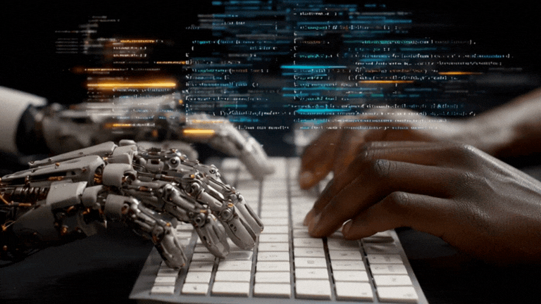

# Hey there! 👋 I'm Tan Duong

  

---

## 🚀 About Me

I'm a **Software Engineer** with 2+ years of experience building **ERP systems and web applications** for real-world business operations.

- 💼 Currently working at **Tedfast** (Backend-focused)
- 🔧 Strong in **PHP (Laravel), MySQL, RESTful APIs**
- 🏢 Built systems used in **multi-branch environments (21+ branches)**
- ⚙️ Experienced in **Linux VPS deployment (LAMP stack)**
- 🤖 Using **AI tools (Cursor, ChatGPT)** to improve productivity and code quality
- 🎯 Goal: Become a strong **Backend / Fullstack Engineer (System Design level)**
- 📫 Reach me: **tanduong969@gmail.com**

---

## 💼 What I Do

### 🧠 Backend & System Development
- Build scalable backend systems using **Laravel (MVC)**
- Design and develop **RESTful APIs**
- Handle **business logic & system architecture**
- Optimize **database performance (MySQL)**

### 🏢 Enterprise Systems (ERP)
- Develop and maintain **ERP systems for real business workflows**
- Work with **multi-branch data and operations**
- Focus on **scalability, performance, and maintainability**

### ⚙️ Deployment & Operations
- Deploy and maintain systems on **Linux VPS**
- Configure domain, environment, and production systems
- Ensure system **stability and reliability**

---

## 🛠️ Technical Skills

### 🚀 Backend

### 🗄️ Database

### 🌐 Frontend (Supporting)

### ⚙️ Tools & Environment

---

## 📌 Featured Projects

### 🏢 Enterprise ERP System (Multi-branch)
- Built and maintained ERP systems for business operations
- Developed backend using **Laravel + MySQL**
- Designed APIs and handled complex business workflows
- 📊 Deployed system serving **21+ branches**

---

### 🤖 AI-Powered Multilingual CMS
- Built CMS platform with **AI translation (Vietnamese ↔ English)**
- Backend: Laravel (RESTful API)
- AI service: FastAPI + M2M100
- Deployed on Linux with **Cloudflare Tunnel**

---

## ⚡ Engineering Mindset

- Focus on **real-world systems, not just demo projects**
- Prioritize **clean code, performance, and scalability**
- Use **AI-assisted development (Cursor, ChatGPT)** effectively
- Always learning and improving in **system design & backend architecture**

---

## 📈 GitHub Stats

  

  

---

## 🤝 Let's Connect!

I'm open to:
- 💼 Backend / PHP / Laravel opportunities
- 🚀 ERP / SaaS / System-based projects
- 🤝 Collaboration & learning

---

  <i>“Build systems that solve real problems at scale.”</i>

